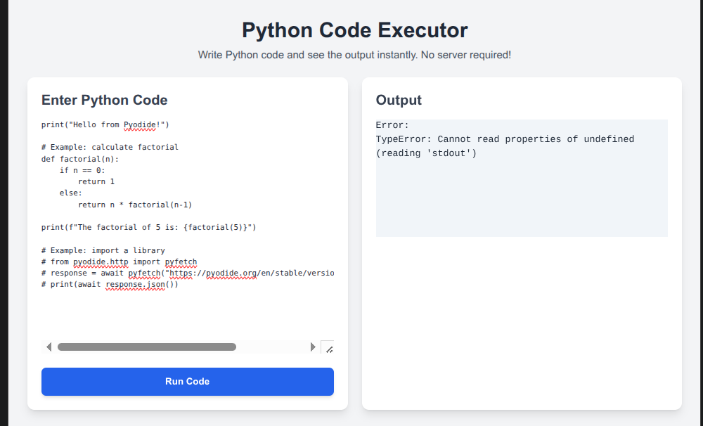

# Amharic-English Machine Translation Comparator Project 

# Overview
This project is a machine translation application designed to compare the performance of various transformer-based models for translating text from Amharic to English. The application provides a user-friendly interface to input Amharic text, receive translations from multiple models simultaneously, and visualize their performance metrics. The goal is to identify the most effective and efficient transformer architecture for this specific language pair.

# Key Features
* Multi-Model Translation: Translate a single Amharic text snippet using several different transformer models.
* Performance Comparison: View and compare key metrics for each translation, such as BLEU score, model latency, and other qualitative assessments.
* Intuitive UI: A clean and responsive user interface for easy text input, model selection, and result viewing.
* Extensible Architecture: Designed to easily integrate new transformer models for future comparisons.ModelsThe application is built to support a variety of transformer models. Initial models included in this project are:Base 
*  Transformer Model: A standard, vanilla transformer architecture trained from scratch on the Amharic-English dataset.Pre-trained Transformer Model (e.g., mBART-50): 
* A multilingual pre-trained model fine-tuned for the Amharic-English language pair.
* Distilled Transformer Model: A smaller, more efficient version of a larger transformer model, optimized for faster inference with minimal loss in accuracy.DatasetThe models are trained and evaluated on a custom-curated Amharic-English parallel corpus. The dataset consists of parallel sentences sourced from various domains to ensure a broad coverage of vocabulary and grammar. The dataset is split into training, validation, and test sets to facilitate robust model training and evaluation.Getting StartedFollow these instructions to get a copy of the project up and running on your local machine.
# Prerequisites
* Python 3.8 or laterpip package managerInstallationClone the repository:git clone [https://github.com/your-username/amharic-english-translation.git](https://github.com/your-username/amharic-english-translation.git)
		cd amharic-english-translation
* Create a virtual environment (recommended):python -m venv venv
		source venv/bin/activate  # On Windows, use `venv\Scripts\activate`
* Install the required Python packages:pip install -r requirements.txt
* Download the pre-trained models and datasets (instructions to be provided in a separate file or script).UsageStart the application:python main.py
* Open your web browser and navigate to http://127.0.0.1:5000 (or the address shown in the terminal).Enter the Amharic text you wish to translate into the input box.Click "Translate" to see the output from each of the configured models. The results page will display the translated text and performance metrics for each model.Project Structure.
			├── python_files/                     # Trained model checkpoints and tokenizer python files
			├── htmlfiles/                       # Dataset files (e.g., amharic-en-corpus.txt)
			├--
We welcome contributions! Please feel free to open an issue or submit a pull request. For major changes, please open an issue first to discuss the proposed changes.LicenseThis project is licensed under the MIT License - see the LICENSE file for details.
